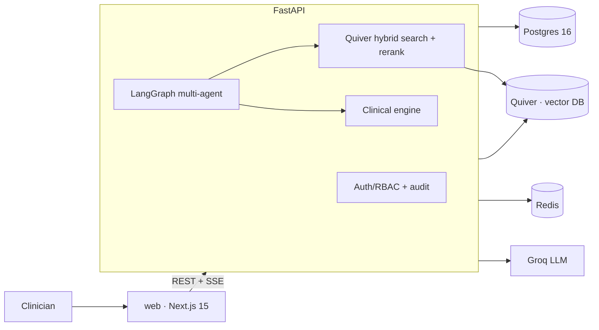

<!-- PULSE LOGO -->
<p align="center">
  <svg width="80" height="40" viewBox="0 0 80 40" fill="none" xmlns="http://www.w3.org/2000/svg">
    <polyline points="0,20 15,20 22,5 30,35 38,10 46,30 54,20 80,20" stroke="#E11D48" stroke-width="2.5" fill="none" stroke-linecap="round" stroke-linejoin="round"/>
  </svg>
</p>

<h1 align="center">Pulse</h1>
<p align="center"><strong>Aortic &amp; endovascular surgery intelligence — from referral to recovery.</strong></p>

<p align="center">
  <a href="https://github.com/achref-soua/pulse/actions"></a>
  <a href="https://github.com/achref-soua/pulse/releases/latest"></a>
  <a href="LICENSE"></a>
</p>

> **Educational demo on synthetic data — not for clinical use; not medical advice.**

---

## Why Pulse

The original `CardioSurg-AI-Assistant` (Streamlit + ChromaDB) proved the concept: phase-aware AI assistance across pre-op / intra-op / post-op, five-source RAG, patient-context detection.

Pulse rebuilds every layer on a production-grade stack:

| Old                        | New                                              |
|----------------------------|--------------------------------------------------|
| Streamlit chat              | Next.js 15 dashboard — full clinical UI          |
| ChromaDB                   | **Quiver** — the owner's own vector DB           |
| Minimal LangGraph stub     | Real stateful multi-agent LangGraph graph        |
| Random synthetic patients  | 200 clinically-correlated synthetic patients     |
| No clinical calculators    | RCRI, CHA₂DS₂-VASc, HAS-BLED, NEWS2, GAS, EuroSCORE II, IFU-fit engine |
| No auth                    | JWT + RBAC (surgeon / anesthetist / nurse / admin) |

---

## Features

- **Patient roster** — 200 synthetic aortic-surgery patients with full anatomy, comorbidities, labs, meds, vitals, and clinical notes
- **Risk & suitability tools** — interactive calculators (RCRI, CHA₂DS₂-VASc, HAS-BLED, NEWS2, GAS, EuroSCORE II) + anatomical IFU device-fit engine
- **AI Copilot** — streaming multi-agent chat, phase- and patient-aware, tool-using, source-citing
- **Knowledge base** — guidelines, literature, device catalog; browse + semantic search
- **Post-op monitoring** — vitals time-series + NEWS2 with color bands + AI deterioration flags
- **PDF reports** — pre-op assessment or discharge summary with AI-written narrative
- **Admin** — user CRUD, roles, audit log viewer

Screenshots: `` *(generated by `task screenshots`)*

---

## Architecture



Five services: **web** (Next.js), **api** (FastAPI), **db** (Postgres 16), **quiver** (vector store — the owner's own [Quiver](https://github.com/achref-soua/quiver) project), **redis**. The knowledge base lives entirely in Quiver: embeddings, document payloads, and metadata for hybrid search. Postgres holds only relational app data.

---

## Quickstart

```bash
git clone https://github.com/achref-soua/pulse.git
cd pulse
cp .env.example .env
# Add your Groq API key for AI features (optional — app runs without it):
# GROQ_API_KEY=gsk_...
task up       # docker compose up -d --build --wait
task migrate  # run Alembic migrations
task seed     # populate Postgres + Quiver with synthetic data
```

Open http://localhost:3000 and log in:

| Role        | Email                     | Password              |
|-------------|---------------------------|-----------------------|
| Surgeon     | surgeon@demo.pulse        | demo-surgeon-2024     |
| Nurse       | nurse@demo.pulse          | demo-nurse-2024       |
| Admin       | admin@demo.pulse          | demo-admin-2024       |

---

## Full build & run reference

```bash
# Install dependencies
pnpm install
cd apps/api && uv sync && cd ../..

# Individual services (dev mode)
cd apps/web && pnpm dev          # http://localhost:3000
cd apps/api && uv run uvicorn app.main:app --reload --port 8000

# Tests
task test           # all tests
task test:api       # pytest only
task test:web       # vitest only
task e2e            # Playwright E2E

# Lint & type-check
task lint
task type-check

# Regenerate TypeScript API types from OpenAPI spec
task openapi-types

# Regenerate screenshots
task screenshots

# Full reset (wipe volumes, remigrate, reseed)
task reset
```

---

## Configuration reference

| Variable                        | Default                                    | Required       | Description                                   |
|---------------------------------|--------------------------------------------|----------------|-----------------------------------------------|
| `DATABASE_URL`                  | `postgresql+asyncpg://pulse:…@db:5432/pulse` | Yes           | Async SQLAlchemy DSN                          |
| `QUIVER_URL`                    | `http://quiver:8080`                       | Yes            | Quiver server URL                             |
| `QUIVER_API_KEY`                | `dev-quiver-key-change-me`                 | Yes            | Quiver API key                                |
| `REDIS_URL`                     | `redis://redis:6379/0`                     | Yes            | Redis connection URL                          |
| `JWT_SECRET`                    | —                                          | Yes            | JWT signing secret (≥32 chars)               |
| `GROQ_API_KEY`                  | —                                          | AI features    | Groq API key                                  |
| `GROQ_MODEL`                    | `llama-3.3-70b-versatile`                  | No             | Default generation model                      |
| `GROQ_ROUTER_MODEL`             | `llama-3.1-8b-instant`                     | No             | Fast router model                             |
| `EMBEDDING_MODEL`               | `BAAI/bge-small-en-v1.5`                   | No             | Sentence-transformer model                    |
| `RERANK_ENABLED`                | `true`                                     | No             | Enable cross-encoder reranking               |
| `ENVIRONMENT`                   | `development`                              | No             | `development` \| `production`                |

See `.env.example` for the full list with descriptions.

---

## Clinical scores

All calculators are deterministic, unit-tested against published references, and never approximated by the LLM.

| Score            | Domain                             |
|------------------|------------------------------------|
| RCRI             | Cardiac risk — vascular surgery    |
| CHA₂DS₂-VASc    | Stroke risk in AFib                |
| HAS-BLED         | Bleeding risk                      |
| NEWS2            | Post-op early warning              |
| GAS              | AAA operative risk                 |
| EuroSCORE II     | Cardiac surgery operative risk     |
| IFU-fit engine   | Device suitability for EVAR/TEVAR  |

See [`docs/clinical/REFERENCES.md`](docs/clinical/REFERENCES.md) for all cited sources.

---

## Deployment

`docker compose up -d --build` is the intended deployment method. See [`docs/architecture.md`](docs/architecture.md) for service boundaries and configuration guidance.

---

## License

[AGPL-3.0](LICENSE) — © 2024-2026 Achref Soua

> **Disclaimer:** Pulse is an educational demo on fully synthetic data. It is not a medical device, does not constitute medical advice, and must not be used for clinical decision-making on real patients.
