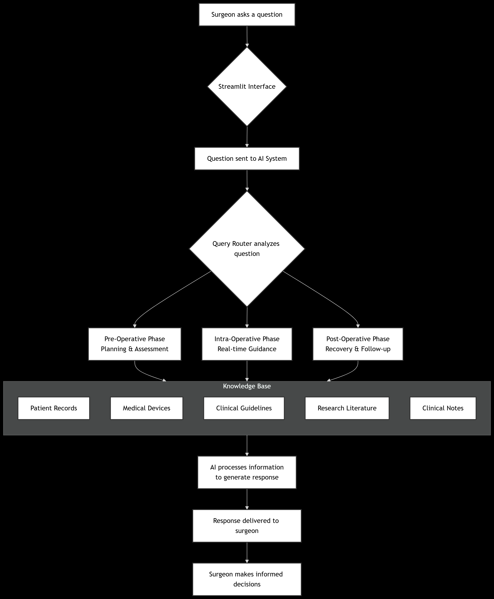

# CardioSurge AI Assistant - Multi-Agent AI System

## Overview
The **CardioSurge AI Assistant** is an AI-powered decision support system designed to assist heart surgeons across three critical phases of patient care: **pre-operative planning**, **intra-operative guidance**, and **post-operative management**. The system leverages a **multi-agent architecture**, **retrieval-augmented generation (RAG)**, and specialized knowledge bases to provide **context-aware, evidence-based recommendations**.

---

## Key Features
- **Phase-Specific Assistance**: Automatically routes queries to the appropriate surgical phase (pre-op, intra-op, post-op).  
- **Patient-Specific Context**: Recognizes patient identifiers and focuses responses on specific cases.  
- **Multi-Source Knowledge Base**: Integrates information from five specialized collections:
  1. Patient records and medical history  
  2. Medical device specifications and instructions  
  3. Clinical practice guidelines  
  4. Medical research literature  
  5. Clinical notes from various phases  
- **Intelligent Query Routing**: Uses LLM-based analysis to determine the most relevant information sources.  
- **Conversation Memory**: Maintains context across interactions while staying focused on current queries.  

---

## Architecture
The system employs a **modular architecture** with the following components:



### Core Components
- **Streamlit Frontend**: User interface for interacting with the AI assistant.  
- **Multi-Agent System**: Specialized agents for each surgical phase.  
- **LangGraph Orchestration**: Coordinates workflow between components.  
- **ChromaDB Vector Store**: Knowledge base with medical information.  
- **RAG Implementation**: Retrieval-augmented generation for evidence-based responses.  

### Knowledge Collections
- **Patients**: Demographic information, medical history, diagnoses.  
- **Devices**: Specifications, sizing, deployment instructions, contraindications.  
- **Guidelines**: Clinical protocols and best practices.  
- **Literature**: Research studies and technical innovations.  
- **Notes**: Clinical observations and procedure documentation.  

---

## Installation

### Prerequisites
- Python 3.8+  
- Groq API account and API key  
- Required Python packages (`requirements.txt`)  

### Setup Instructions
1. **Clone the repository**:
```bash
git clone https://github.com/achref-soua/CardioSurg-AI-Assistant
cd cardiac-surgery-assistant
```
2. **Install dependencies**:
```bash
pip install -r requirements.txt
```
3. **Set up environment variables**:
- Create a `.env` file in the root directory.  
- Add your Groq API key:  
```bash
GROQ_API_KEY=your_api_key_here
```
- Ensure your ChromaDB vector store is properly set up in the `database/chroma_db/` directory.  

---

## Usage

### Starting the Application
```bash
streamlit run app.py
```

### Interacting with the System
- Open your web browser to the provided localhost URL.  
- Type your questions in the chat interface.  
- For patient-specific queries, include the patient ID (e.g., "What are the risks for patient P003?").  
- The system will automatically determine the appropriate surgical phase and information sources.

### Example Queries
- "What risks can patient P003 have before the operation?"  
- "What is the best device for this patient according to their medical data?"  
- "What are the deployment steps for the EndoFlex device?"  
- "What post-operative care is recommended after TEVAR procedures?"  

---

## Project Structure
```
CardioSurge AI Assistant/
├── app.py                 # Main Streamlit application
├── requirements.txt       # Python dependencies
├── .env                   # Environment variables (not in repo)
├── .gitignore             # Git ignore rules
├── agents/                # Agent implementations
│   ├── orchestrator.py    # Main coordination agent
│   └── base_agent.py      # Base agent class
├── rag/                   # Retrieval-augmented generation components
│   ├── retriever.py       # ChromaDB query interface
│   ├── embedding.py       # Text embedding utilities
│   └── query_router.py    # LLM-based query routing
├── database/              # Data storage and processing
│   ├── data_scripts/      # Data generation scripts
│   ├── preprocessed_data/ # Processed JSON files
│   └── chroma_db/         # Vector database (not in repo)
└── workflows/             # LangGraph workflow definitions
    ├── graph.py           # Main workflow graph
    └── nodes.py           # Reusable workflow nodes
```

---

## Configuration

### Environment Variables
- `GROQ_API_KEY`: Your Groq API key for accessing LLM services  
- Additional variables can be added as needed for deployment  

### Model Configuration
- **LLM**: llama-3.1-8b-instant via Groq API  
- **Embedding Model**: BAAI/bge-large-en-v1.5  

---

## Customization

### Adding New Knowledge Sources
1. Add new JSON files to `database/preprocessed_data/`.  
2. Update the data processing scripts in `database/data_scripts/`.  
3. Modify the retriever to include the new collection.  

### Modifying Agent Behavior
- Edit system prompts in `rag/prompt_templates.py` to adjust agent personalities and response styles.  

### Extending Functionality
- New agents can be added by creating specialized classes in `agents/` and updating the orchestrator.  

---

## Limitations and Considerations
- This is a **decision support tool**, not a replacement for clinical judgment.  
- The data used in the vector database is **fake** and **synthetic**, and it cannot be used for medical purposes.
- Always verify critical information with established guidelines and colleagues.  
- Knowledge is limited to what is contained in the vector database.  
- Patient data should be properly anonymized and secured in production.  

---

## Future Enhancements
- Integration with electronic health record (EHR) systems  
- Real-time data processing during procedures  
- Advanced visualization of anatomical data  
- Multi-modal input support (images, lab results)  
- Expanded medical specialty support  

---

## Support
For technical support or implementation questions, refer to the documentation or create an issue in the project repository.  

---

## License
This project is intended for **research and educational purposes**. Ensure compliance with all healthcare regulations and data protection laws in clinical environments.  

> **Note:** This application is a clinical decision support tool. Healthcare providers remain responsible for all medical decisions and should use this tool as a supplementary resource rather than a primary decision-making authority.

