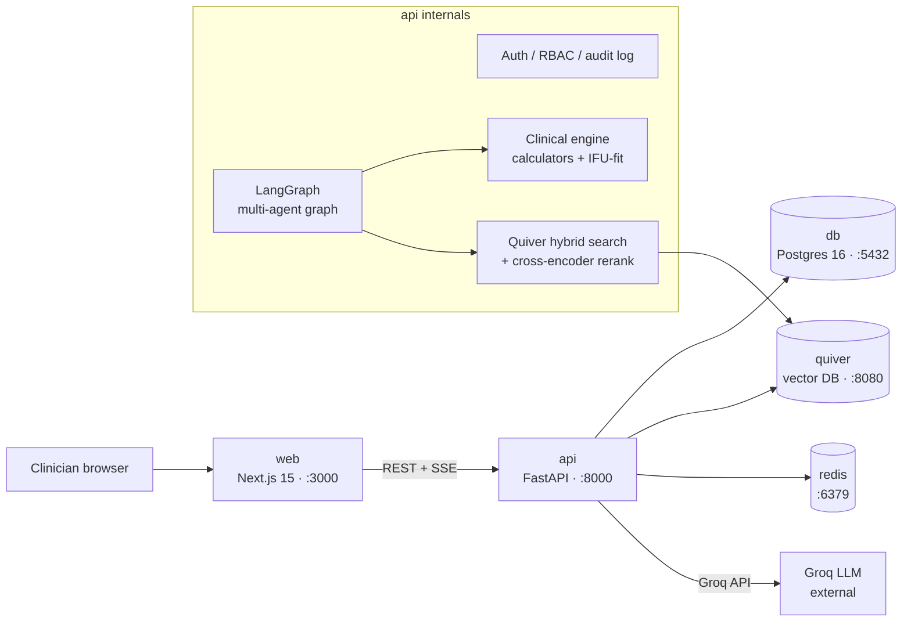

# Architecture

## Overview

Pulse is a five-service Docker Compose application. Each service has a single responsibility; they communicate over the internal Docker network.

### web — Next.js 15 (`apps/web`)

App Router, React Server Components, Tailwind + shadcn/ui. Communicates with the api exclusively via REST (data fetching) and SSE (streaming chat). Generates TypeScript types from the api's OpenAPI schema so request/response shapes never drift.

### api — FastAPI (`apps/api`)

The core backend. Async SQLAlchemy 2.0 + Alembic for relational data. Exposes REST endpoints and SSE for streaming. Hosts the LangGraph multi-agent graph, clinical calculator engine, and Quiver RAG layer. All patient-data access is audit-logged.

### db — PostgreSQL 16

Relational application data: users, patients, comorbidities, labs, medications, vitals, devices, clinical notes, conversations, risk assessments, audit log. No vector columns — all embedding workloads go to Quiver.

### quiver — Vector database

The owner's own from-scratch vector database ([github.com/achref-soua/quiver](https://github.com/achref-soua/quiver)). Holds five collections: `patients`, `devices`, `guidelines`, `literature`, `notes`. Provides hybrid (vector + keyword) filtered search with encryption-at-rest. The api talks to it via the official Python SDK.

### redis

Response and embedding cache, rate limiting, and LangGraph checkpoint store.

## Data flow — AI Copilot query

1. Browser sends a chat message via SSE endpoint `/ai/chat`.
2. **Router node**: fast Groq model extracts patient id, detects phase, selects Quiver collections and clinical tools.
3. **Retrieve node**: Quiver hybrid search over the selected collections, optional cross-encoder rerank.
4. **Tools node**: deterministic clinical calculators called as structured tool calls (scores never approximated by the LLM).
5. **Generate node**: Groq streams a cited answer grounded in retrieved chunks and tool results.
6. **Guardrail node**: enforces grounding, strips unsupported claims, appends disclaimer.
7. SSE chunks arrive in the browser and stream into the chat UI.
